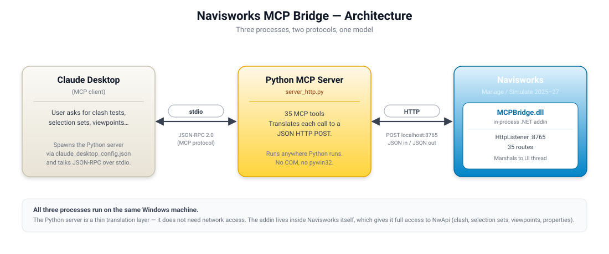
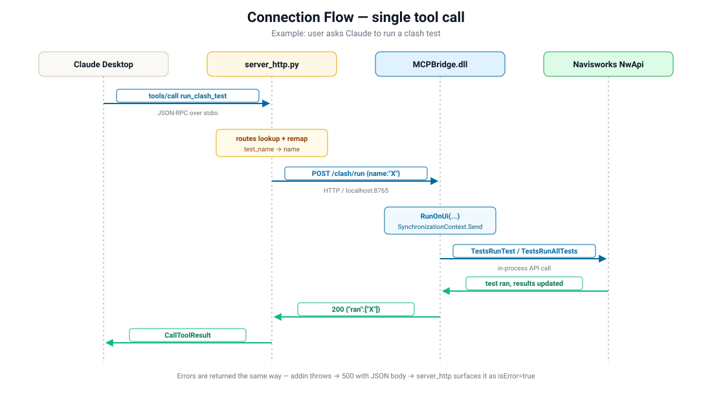

# Navisworks MCP Bridge

> Control Autodesk Navisworks from Claude — clash detection, selection sets, search sets, viewpoints, properties, color overrides, and 30+ other operations — through the Model Context Protocol.

<p align="center">
  
</p>

## What this is

A two-piece bridge that lets any MCP-compatible client (Claude Desktop, Claude Code, Cline, Continue, etc.) drive a running instance of Navisworks Manage or Simulate.

| Piece | Lives in | Talks |
|---|---|---|
| **`MCPBridge.dll`** | Inside Navisworks as a .NET addin | Hosts an HTTP server on `localhost:8765` |
| **`server_http.py`** | Standalone Python process spawned by the MCP client | Translates MCP `tools/call` → JSON HTTP `POST` |

The Python side has zero coupling to Navisworks — it just speaks HTTP. The C# side has zero coupling to MCP — it just exposes a tiny REST surface. Either can be replaced independently.

## Why a two-piece design (instead of COM)

The earlier COM-based server had four hard problems:

1. **ProgID year matching** — `Navisworks.Application.2026` vs `2027`, etc.
2. **Same-Windows-user-session** required for `GetActiveObject` to find the running instance.
3. **COM registration** broken by Windows updates and Navisworks repair installs.
4. **Limited API surface** — COM exposes ~20% of what NwApi can do (no clash, no search sets, no overrides).

Running an addin **inside** Navisworks sidesteps every one of these. Full NwApi access. No registration. No version detection. No `pywin32`.

## Prerequisites

Install these once on the machine that runs Navisworks:

| Software | Purpose | Where to get it |
|---|---|---|
| **Windows 10/11 (64-bit)** | OS | — |
| **Navisworks Manage** or **Simulate** 2025 / 2026 / 2027 | The host application. Freedom is **not** supported (no .NET API). | autodesk.com |
| **.NET 8 SDK** | To build `MCPBridge.dll` | [dotnet.microsoft.com/download](https://dotnet.microsoft.com/download) |
| **Python 3.10+** | To run `server_http.py` | [python.org/downloads](https://www.python.org/downloads/) |
| **MCP Python SDK** | The Python server depends on it | `pip install mcp` |
| **An MCP client** | Claude Desktop, Claude Code, Cline, Continue, etc. | claude.ai/download (or any) |

Optional but recommended: **Visual Studio 2022 17.8+** if you want IDE intellisense for the addin code. Building from the command line works without it.

## Install — quick path

```powershell
# 1. Build the addin
cd E:\MCP\Navisworks_MCP\addin
dotnet build -c Release `
  -p:NavisworksInstallDir="C:\Program Files\Autodesk\Navisworks Manage 2027"

# 2. Deploy it to Navisworks' plugin folder
.\Install-Addin.ps1 -Year 2027

# 3. Install the Python MCP SDK
pip install mcp

# 4. Wire into your MCP client (see below) and restart it
```

That's the whole loop. Build, deploy, configure, restart.

## Install — step by step

### 1. Build the addin

From a Developer PowerShell (or a regular PowerShell with `dotnet` on PATH):

```powershell
cd Your_Parth_To_Files\addin

# If your Navisworks is in the default location and you're targeting 2027:
dotnet build -c Release

# Otherwise pass the install dir explicitly:
dotnet build -c Release `
  -p:NavisworksInstallDir="C:\Program Files\Autodesk\Navisworks Manage 2026"
```

Output lands in `addin\bin\Release\` — you should see `MCPBridge.dll` and `MCPBridge.addin` after a clean build.

### 2. Deploy to Navisworks' plugin folder

The included installer does it correctly:

```powershell
cd Your_Parth_To_Files\addin
.\Install-Addin.ps1 -Year 2027
```

It copies the DLL, the `.addin` manifest, and any transitive dependencies into:

```
%APPDATA%\Autodesk\Navisworks Manage 2027\Plugins\MCPBridge\
```

For Navisworks 2026, pass `-Year 2026`. For 2025, `-Year 2025`. Manage and Simulate use the same path schema (`Manage` vs `Simulate` in the folder name).

If you prefer manual install, copy `MCPBridge.dll` and `MCPBridge.addin` into that folder yourself. The folder name **must** be exactly `MCPBridge` — Navisworks matches it against the `<Plugin Name="MCPBridge">` attribute in the manifest.

### 3. Verify the addin loads

1. Start Navisworks.
2. Open any model.
3. Switch to the **Add-Ins** ribbon — an **MCP Bridge** button should appear.
4. Click it. A dialog confirms `Status: listening on http://localhost:8765/`.

Or test from PowerShell with no MCP client involved:

```powershell
Invoke-RestMethod http://localhost:8765/health
# ok      : True
# version : 2.1
# port    : 8765
# routes  : 35
```

### 4. Wire into Claude Desktop

Edit `%APPDATA%\Claude\claude_desktop_config.json`:

```json
{
  "mcpServers": {
    "navisworks": {
      "command": "python",
      "args": ["Your_Parth_To_Files\\addin\\server_http.py"]
    }
  }
}
```

Restart Claude Desktop. The Navisworks tools appear in the tool picker — `health_check`, `get_document_info`, `create_clash_test`, etc.

For other MCP clients (Claude Code, Cline, Continue, etc.) the config schema is the same — point `command` + `args` at `server_http.py`.

## How a tool call flows end-to-end

<p align="center">
  
</p>

1. The MCP client sends a JSON-RPC `tools/call` over **stdio** to `server_http.py`.
2. `server_http.py` looks the tool name up in `ROUTES`, remaps any user-facing argument names (e.g. `test_name` → `name`), and **POSTs** the JSON body to `http://localhost:8765/<route>`.
3. The addin receives the request on a worker thread, then marshals the actual API call onto the **Navisworks UI thread** using `SynchronizationContext.Send`. The Navisworks API is single-threaded; this is the only safe way to call it.
4. The handler runs the NwApi call, builds an anonymous result object, and returns it.
5. The addin serializes that to JSON and writes it back as the HTTP response.
6. `server_http.py` wraps it in an MCP `CallToolResult` and writes that to stdout.
7. The MCP client renders the result in the chat.

If the handler throws, the addin returns HTTP 500 with `{error, detail, path}`, and `server_http.py` surfaces that body verbatim — no information loss.

## Available tools (35)

Argument names below are the **MCP tool argument names** (what the LLM sees). The addin's HTTP body uses some shorter aliases — `server_http.py` does the rename.

### Document

| Tool | Purpose |
|---|---|
| `health_check` | Liveness probe. Returns `{ok, version, port, routes}`. |
| `get_document_info` | Title, filename, units, model count, per-model file paths. |
| `get_model_statistics` | Element counts grouped by class display name. |

### Clash detection

| Tool | Required args | Purpose |
|---|---|---|
| `list_clash_tests` | — | All clash tests with status and result count. |
| `create_clash_test` | `name` | Create a Hard / Clearance / Duplicate test. Optionally attach `selectionA` / `selectionB` to populate sides. |
| `set_clash_selections` | `test_name` | Attach selection-sets / search-sets to A and/or B on an existing test (preserves history). |
| `run_clash_test` | — | Run one test by `test_name`, or all tests if omitted. |
| `get_clash_results` | `test_name` | Result list with status, distance, items. |
| `delete_clash_test` | `test_name` | Remove a test by name. |

### Selection sets / search sets

| Tool | Required args | Purpose |
|---|---|---|
| `list_sets` | — | Every saved selection set and search set. |
| `create_selection_set` | `name` | Save the current viewport selection as a named set. |
| `get_selection_set_items` | `name` | Items in a named set (search sets re-evaluated live). |
| `create_search_set` | `name`, `value` | Property-based saved search. Operators: `equals`, `contains`, `startsWith`, `endsWith`. |
| `execute_search_set` | `name` | Re-run a saved search and return match count. |
| `delete_set` | `name` | Remove a selection or search set. |

### Find / properties / selection

| Tool | Required args | Purpose |
|---|---|---|
| `find_items` | `value` | Single-condition property search. |
| `find_items_by_name` | `pattern` | Substring match on element display names. |
| `select_all` / `deselect_all` / `invert_selection` | — | Bulk selection ops. |
| `select_from_set` | `name` | Replace current selection with a named set's contents. |
| `get_current_selection` | — | First N selected items + total count. |
| `get_element_properties` | — (or `name`) | All property tabs/values for the first selected (or named) item. |

### Color / visibility

| Tool | Required args | Purpose |
|---|---|---|
| `color_elements` | `r, g, b` | Permanent color override (0–255 RGB). |
| `set_transparency` | — | 0.0 opaque … 1.0 fully transparent. |
| `hide_elements` / `unhide_all` / `isolate_elements` | — | Visibility ops on the current selection. |
| `reset_overrides` | — | Clear every color/transparency override and unhide everything. |

### Viewpoints

| Tool | Required args | Purpose |
|---|---|---|
| `list_viewpoints` | — | All saved viewpoints (recursive through groups). |
| `save_viewpoint` | `name` | Save current camera as a named viewpoint. |
| `goto_viewpoint` | `name` | Navigate to a saved viewpoint. |
| `delete_viewpoint` | `name` | Remove a saved viewpoint. |
| `get_current_viewpoint` | — | Current camera position, projection, focal distance. |

The complete route definitions live in `addin/MCPBridgePlugin.cs` (`Router.Dispatch`).

## Troubleshooting

**The MCP Bridge button doesn't appear in Navisworks.**
Wrong install location is the #1 cause. The `.addin` manifest must sit alongside the DLL in `%APPDATA%\Autodesk\Navisworks Manage 20XX\Plugins\MCPBridge\`. The folder name must be exactly `MCPBridge`. Restart Navisworks after copying. If that doesn't work, run `addin/Diagnose-Addin.ps1` — it checks paths, file presence, and the Mark-of-the-Web flag on each DLL.

**`/health` returns connection refused.**
Open Navisworks. The listener auto-starts on plugin load, but if the plugin loaded without a UI `SynchronizationContext` (rare, but seen on some configurations), click the **MCP Bridge** ribbon button once to force-start it.

**Port 8765 already in use.**
Edit the `Port` constant near the top of `addin/MCPBridgePlugin.cs`, recompile, redeploy. Then update `ADDIN_BASE` in `addin/server_http.py` to match.

**HTTP 500 on every call.**
Check `%TEMP%\navisworks_mcp_addin.log`. Most often the message is `no active document` — open a model file and retry.

**Claude shows the navisworks server but no tools list it.**
The Python server probably crashed on startup. Run it manually to see the error:
```powershell
python E:\MCP\Navisworks_MCP\addin\server_http.py --test
```
This runs the self-test (no MCP client needed) and prints the addin's `/health` plus document info to stderr.

**Two MCP clients can't share the bridge at the same time.**
The HTTP listener accepts one request at a time and serializes them onto the UI thread. Two clients work fine — they queue. But if you have, say, both Claude Desktop and Cline configured to talk to the same Navisworks, the plugin will service them round-robin. There is no per-client isolation.

## Logs

| File | What it contains |
|---|---|
| `%TEMP%\navisworks_mcp_addin.log` | Every request the addin received, plus exception detail. Append-only. |
| stderr of `server_http.py` | Python-side errors (rare — most issues end up in the addin log). MCP clients usually surface this in their dev console. |

## Project layout

```
Navisworks_MCP/
├── README.md                          ← you are here
├── docs/
│   ├── architecture.svg
│   └── connection-flow.svg
├── addin/                             ← the .NET in-process plugin
│   ├── MCPBridgePlugin.cs             ← ~1700 LOC: HTTP listener, router, 35 handlers
│   ├── MCPBridge.addin                ← Navisworks plugin manifest
│   ├── NavisworksMcpAddin.csproj
│   ├── NavisworksMcpAddin.sln
│   ├── server_http.py                 ← Python MCP server (HTTP edition)
│   ├── Install-Addin.ps1              ← deploys bin/Release into Plugins/MCPBridge
│   ├── Diagnose-Addin.ps1             ← post-install sanity check
│   └── README.md                      ← addin-only details
└── Archive/                           ← previous COM-based attempt, kept for reference
    ├── server.py
    ├── pyproject.toml
    └── ...
```

## Contributing

The plugin's design rules:

- **Zero NuGet runtime dependencies.** JSON parsing and serialization are hand-rolled (`Json` class). The reason is that Navisworks loads its own copy of various BCL assemblies in-process; pulling in `System.Text.Json` or Newtonsoft would mean fighting version conflicts at load time.
- **Every handler is single-threaded.** Add new handlers as static methods on `Handlers` and dispatch them through `RunOnUi` in `MCPBridgePlugin.Dispatch`.
- **Throw on error.** The dispatcher converts exceptions into HTTP 500 + JSON. Don't swallow.
- **Use `SavedItemReference` for clash tests.** Direct `ClashTest` references obtained from `Children` go stale after iteration — capture a `SavedItemReference` and re-resolve before each operation. See `ClashSetSelections` for the pattern.

Adding a new MCP tool is two edits:

1. New case in `addin/MCPBridgePlugin.cs` `Dispatch` switch + a static method on `Handlers`.
2. New `Tool(...)` entry in `addin/server_http.py` `TOOLS` and a corresponding `ROUTES` line.

Recompile, redeploy, restart the MCP client.

## License

MIT.
